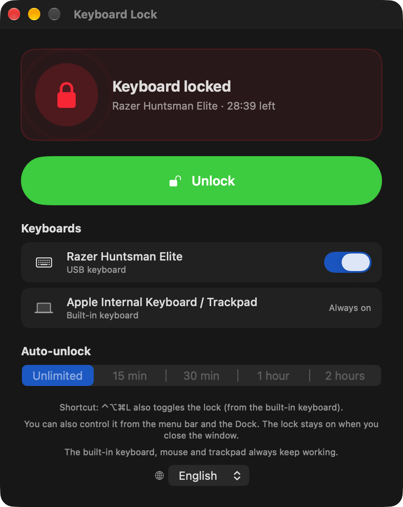
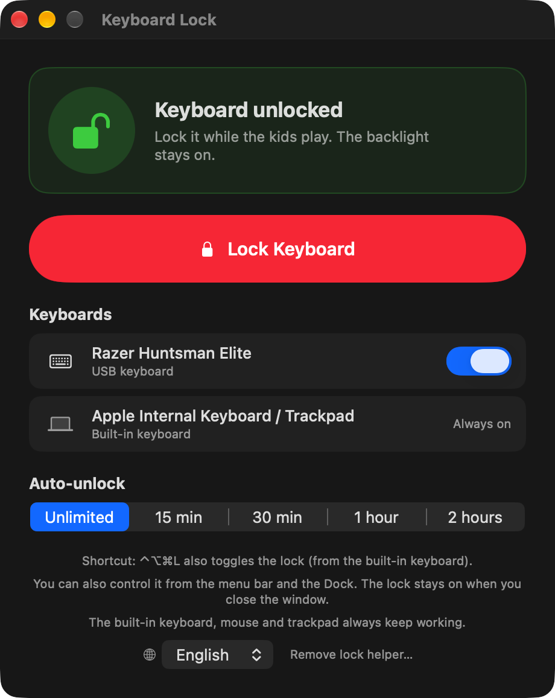
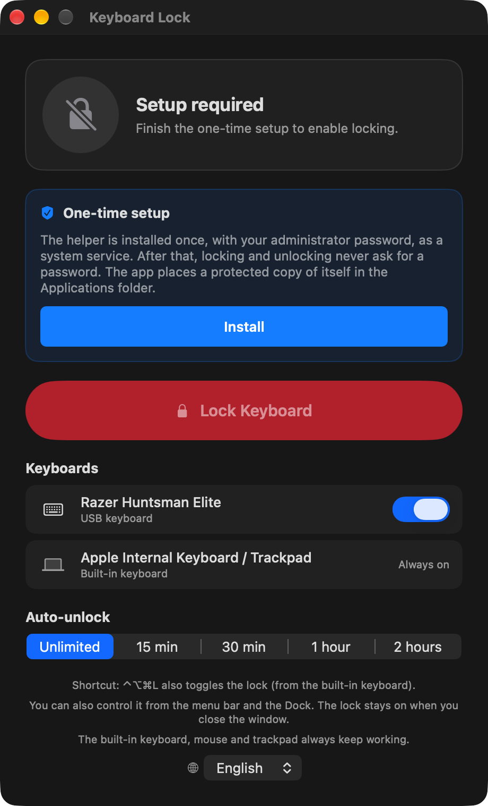

# Keyboard Lock for macOS

**Lock an external USB keyboard with one click while its backlight stays on.** Let the kids (or the cat) bang on it, clean it, or leave it connected during a presentation. The keys do nothing, the lights keep glowing, and your built-in keyboard, mouse and trackpad keep working normally.

[English](README.md) · [Türkçe](README.tr.md)

[](https://github.com/YDX64/macos-keyboard-lock/actions/workflows/build.yml)


<p align="center">
  
  &nbsp;
  
</p>

## Why this exists

Most "keyboard lock" tools either block *every* keyboard (including yours), cut the USB power so the backlight dies, or just show a full-screen cover. Keyboard Lock detaches **one chosen external keyboard** from the system at the HID level. The device stays powered and connected, so RGB and backlight keep running, but macOS no longer receives a single key press from it.

Typical uses:

- A child sits on your lap and wants to "type" on your mechanical keyboard.
- The cat walks across the desk while a long job is running.
- Wiping the keys without triggering shortcuts.
- Presentations and demos where nobody should touch the keyboard.

## Features

- **One-click lock and unlock** from the window, the **menu bar** icon, the **Dock** icon menu, or the global shortcut **⌃⌥⌘L**.
- **Backlight stays on.** Only key events are blocked; vendor lighting interfaces are left alone.
- **Per-keyboard choice.** Lock a USB or Bluetooth keyboard; the built-in keyboard is never locked.
- **Timed lock.** Auto-unlock after 15 min, 30 min, 1 hour or 2 hours, with a countdown in the menu bar and a Dock badge.
- **Clear state at a glance.** Green Dock icon = unlocked, red = locked, orange = keyboard unplugged, gray = setup needed.
- **No password after the first setup.** A small root service is installed once; locking never asks for a password again.
- **Safe by design.** Several safety nets make sure you can never get stuck (see below).
- **English and Turkish.** English is the default; the app follows your macOS language and has an in-app language switch.

## Install

There are no pre-built binaries on purpose: this app installs a small helper that runs as root, so you should build it from source you can read. It takes about a minute.

**Requirements:** macOS 13 or newer, and Xcode or the Command Line Tools (`xcode-select --install`).

```bash
git clone https://github.com/YDX64/macos-keyboard-lock.git
cd macos-keyboard-lock
./build.sh
open KeyboardLock.app
```

### First run (once)

1. Click **Install** in the setup card. macOS asks for your administrator password. This installs the lock service and puts a protected copy of the app in `/Applications`; the app then reopens from there.
<p align="center"></p>

2. Press **Lock Keyboard**. macOS asks for the **Input Monitoring** permission. Click **Allow** (or enable *Keyboard Lock* under System Settings → Privacy & Security → Input Monitoring).
3. Done. From now on locking and unlocking never ask for a password.

> Keyboard Lock does not read or store what you type. macOS calls the permission "Input Monitoring", but the app only uses it to be allowed to detach the keyboard.

## Use

| Action | How |
| --- | --- |
| Lock / unlock | Big button in the window, menu bar icon → *Lock Keyboard*, Dock icon (right-click) or **⌃⌥⌘L** |
| Pick the keyboard | Switch next to each external keyboard in the window |
| Timed lock | Choose *Auto-unlock* before locking |
| Close the window | The lock stays on. The app keeps running in the menu bar |
| Quit | Menu bar icon → *Quit Keyboard Lock*, or ⌘Q. Quitting always unlocks |

## Safety nets

You cannot lock yourself out:

- The **built-in keyboard, mouse and trackpad are never locked.** Click *Unlock* with the mouse at any time.
- If the app stops responding for 20 seconds, the service **releases the keyboard by itself**.
- The lock is **released when the screen locks, the user session changes, or the Mac goes to sleep.**
- On a Mac **without a built-in keyboard** (Mac mini, Studio…) the lock lasts at most **one hour**, enforced inside the service.
- A timed lock **ends on its own**, and the Dock icon bounces to tell you.
- After a **reboot** or a service crash the keyboard is simply free again.

## How it works

1. macOS only lets a *root* process claim exclusive access to a keyboard (`IOHIDDeviceOpen` with `kIOHIDOptionsTypeSeizeDevice`). While a keyboard is seized, its key events never reach the system, yet the device stays powered.
2. The one-time setup therefore registers a tiny `LaunchDaemon` (the same binary started with `--daemon`). It listens on a Unix socket in `/var/run`, accepts commands only from your user, and only knows a handful of plain-text commands (lock, unlock, status, version, info).
3. The app talks to that service over the socket. It never needs your password again.
4. Only real key interfaces (keyboard, keypad, media and system keys) are seized. Interfaces that also carry a mouse or touch surface, and vendor-specific lighting interfaces, are left alone.

Read [SECURITY.md](SECURITY.md) for the full trust model.

## Uninstall

Open the app → *Remove lock helper…* (or menu bar icon → *Remove Helper…*). This stops and deletes the service. Then delete `/Applications/KeyboardLock.app` (needs your password, because the copy is root-owned) and, if you like, remove *Keyboard Lock* from Input Monitoring.

## Troubleshooting

| Symptom | What to do |
| --- | --- |
| "macOS is not granting Input Monitoring…" even though the switch looks on | The permission belongs to an older build. In System Settings → Privacy & Security → Input Monitoring select *Keyboard Lock*, remove it with **−**, quit and reopen the app, press *Lock Keyboard* and click **Allow**. |
| "Another app is using this keyboard exclusively" | Quit software that grabs the keyboard (Karabiner-Elements, Razer Synapse, Logitech tools…) and try again. |
| Locked, but some keys still work | The keyboard exposes several HID interfaces and one was held by other software. Quit that software and lock again. |
| The setup card says *Update* after you rebuilt | The helper protocol changed. Click **Update** once (password) to refresh the installed copy. |
| Two identical keyboards | They share one USB identity, so both are locked together. |

## Tested on

Developed and tested on an Apple silicon Mac running macOS 27 with a USB gaming keyboard. macOS 13+ is the build target. Other macOS versions, Intel Macs, Bluetooth keyboards and keyboards from other vendors are untested, so reports are very welcome.

## Languages

English is the default. The app follows the macOS language and falls back to English; you can also switch with the globe menu in the window. Translations live in `Resources/<language>.lproj/Localizable.strings`. See [CONTRIBUTING.md](CONTRIBUTING.md) to add yours.

## License

[MIT](LICENSE) © 2026 YDX64
