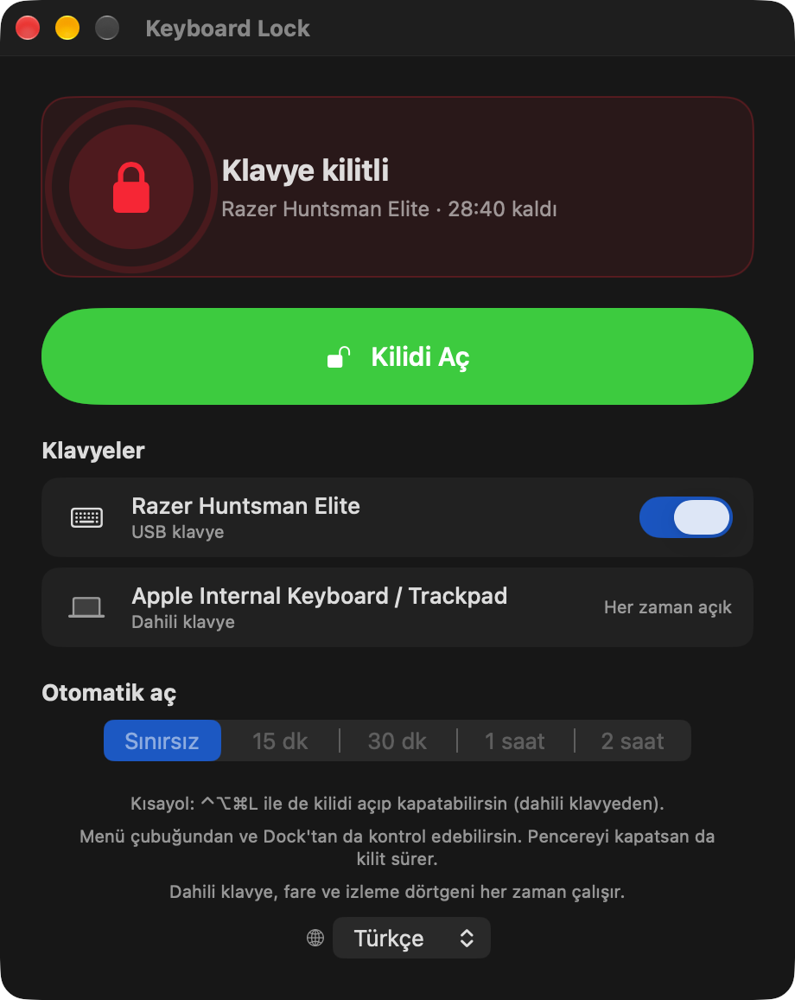
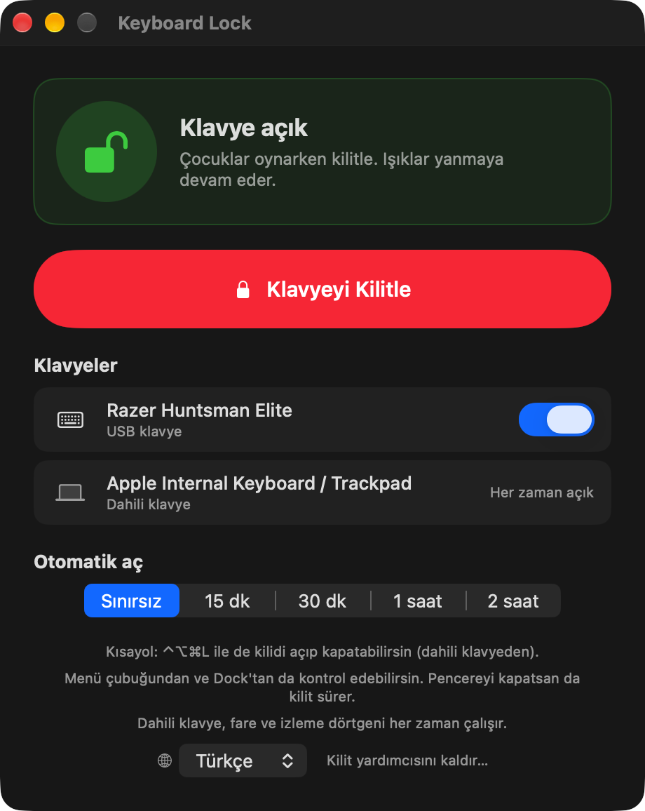

# macOS için Keyboard Lock (Klavye Kilidi)

**Harici USB klavyeyi tek tıkla kilitle, ışıkları yanık kalsın.** Çocuk ya da kedi tuşlara bassın, klavyeyi sil ya da sunum sırasında bağlı bırak. Tuşlar hiçbir şey yapmaz, ışıklar yanmaya devam eder. Dahili klavye, fare ve izleme dörtgeni normal çalışır.

[English](README.md) · [Türkçe](README.tr.md)

[](https://github.com/YDX64/macos-keyboard-lock/actions/workflows/build.yml)


<p align="center">
  
  &nbsp;
  
</p>

## Neden var?

Çoğu "klavye kilidi" aracı ya **tüm** klavyeleri (seninkini de) engeller, ya USB gücünü keserek ışıkları söndürür, ya da ekranı bir perdeyle örter. Keyboard Lock, seçtiğin **tek bir harici klavyeyi** HID düzeyinde sistemden ayırır. Cihaz bağlı ve enerjili kalır, RGB ve arka ışık yanmaya devam eder, ama macOS o klavyeden tek bir tuş bile almaz.

Tipik kullanımlar:

- Çocuk kucağında ve mekanik klavyende "yazı yazmak" istiyor.
- Uzun bir iş çalışırken kedi masanın üstünde geziyor.
- Klavyeyi kısayollar tetiklenmeden silmek.
- Kimsenin dokunmaması gereken sunum ve gösterimler.

## Özellikler

- **Tek tıkla kilitle ve aç:** pencereden, **menü çubuğu** simgesinden, **Dock** simgesinin menüsünden ya da **⌃⌥⌘L** genel kısayolundan.
- **Işıklar yanık kalır.** Yalnızca tuş olayları engellenir, üreticiye özel ışık arayüzlerine dokunulmaz.
- **Klavye bazında seçim.** USB ya da Bluetooth klavyeyi kilitle. Dahili klavye hiçbir zaman kilitlenmez.
- **Süreli kilit.** 15 dk, 30 dk, 1 saat ya da 2 saat sonra otomatik açılır. Menü çubuğunda geri sayım, Dock'ta rozet görünür.
- **Durum bir bakışta.** Yeşil Dock simgesi = açık, kırmızı = kilitli, turuncu = klavye çıkarılmış, gri = kurulum gerekli.
- **İlk kurulumdan sonra şifre yok.** Küçük bir root hizmeti bir kez kurulur. Kilitlerken bir daha şifre sorulmaz.
- **Güvenli tasarım.** Kendini dışarıda bırakmamanı sağlayan birkaç emniyet ağı var (aşağıda).
- **İngilizce ve Türkçe.** Varsayılan dil İngilizce. Uygulama macOS dilini izler ve pencerede dil seçici vardır.

## Kurulum

Hazır derlenmiş dosya bilerek yok: bu uygulama root olarak çalışan küçük bir yardımcı kurar, bu yüzden okuyabildiğin kaynaktan kendin derlemelisin. Yaklaşık bir dakika sürer.

**Gereksinimler:** macOS 13 veya yeni, ayrıca Xcode ya da Komut Satırı Araçları (`xcode-select --install`).

```bash
git clone https://github.com/YDX64/macos-keyboard-lock.git
cd macos-keyboard-lock
./build.sh
open KeyboardLock.app
```

### İlk çalıştırma (bir kez)

1. Kurulum kartındaki **Kur** düğmesine bas. macOS yönetici şifreni sorar. Bu işlem kilit hizmetini kurar ve uygulamanın korumalı bir kopyasını `/Applications` altına koyar. Uygulama oradan yeniden açılır.
2. **Klavyeyi Kilitle**'ye bas. macOS **Girdi İzleme** iznini sorar. **İzin Ver**'e bas (ya da Sistem Ayarları → Gizlilik ve Güvenlik → Girdi İzleme altında *Keyboard Lock*'u aç).
3. Hepsi bu. Bundan sonra kilitlerken ve açarken şifre sorulmaz.

> Keyboard Lock ne yazdığını okumaz ve kaydetmez. macOS bu izne "Girdi İzleme" der, ama uygulama onu yalnızca klavyeyi ayırabilmek için kullanır.

## Kullanım

| İşlem | Nasıl |
| --- | --- |
| Kilitle / aç | Penceredeki büyük düğme, menü çubuğu simgesi → *Klavyeyi Kilitle*, Dock simgesi (sağ tık) ya da **⌃⌥⌘L** |
| Klavye seçimi | Penceredeki her harici klavyenin yanındaki anahtar |
| Süreli kilit | Kilitlemeden önce *Otomatik aç* süresini seç |
| Pencereyi kapatma | Kilit sürer. Uygulama menü çubuğunda çalışmaya devam eder |
| Çıkış | Menü çubuğu simgesi → *Klavye Kilidi'nden Çık* ya da ⌘Q. Çıkış her zaman kilidi açar |

## Emniyet ağları

Kendini dışarıda bırakamazsın:

- **Dahili klavye, fare ve izleme dörtgeni hiçbir zaman kilitlenmez.** Fareyle istediğin an *Kilidi Aç*'a bas.
- Uygulama 20 saniye yanıt vermezse hizmet **klavyeyi kendiliğinden serbest bırakır.**
- **Ekran kilitlenince, kullanıcı oturumu değişince ya da Mac uykuya geçince** kilit açılır.
- **Dahili klavyesi olmayan** Mac'lerde (Mac mini, Studio…) kilit en çok **1 saat** sürer. Bu sınır hizmetin içinde uygulanır.
- Süreli kilit **kendiliğinden biter** ve Dock simgesi zıplayarak haber verir.
- **Yeniden başlatma** ya da hizmet çökmesinden sonra klavye kendiliğinden serbesttir.

## Nasıl çalışır?

1. macOS, bir klavyeye özel erişimi (`IOHIDDeviceOpen`, `kIOHIDOptionsTypeSeizeDevice`) yalnızca *root* süreçlere verir. Klavye bu şekilde ayrıldığında tuş olayları sisteme ulaşmaz, ama cihaz enerjili kalır.
2. Tek seferlik kurulum bu yüzden küçük bir `LaunchDaemon` kaydeder (aynı program `--daemon` ile başlar). Hizmet `/var/run` altında bir Unix soketini dinler, komutları yalnızca senin kullanıcından kabul eder ve yalnızca birkaç düz metin komut bilir (kilitle, aç, durum, sürüm, bilgi).
3. Uygulama bu hizmetle soket üzerinden konuşur. Bir daha şifreye ihtiyaç duymaz.
4. Yalnızca gerçek tuş arayüzleri (klavye, tuş takımı, medya ve sistem tuşları) ayrılır. Fare ya da dokunmatik yüzey de taşıyan arayüzlere ve üreticiye özel ışık arayüzlerine dokunulmaz.

Tüm güven modeli için [SECURITY.md](SECURITY.md) dosyasına bak.

## Kaldırma

Uygulamayı aç → *Kilit yardımcısını kaldır…* (ya da menü çubuğu simgesi → *Yardımcıyı Kaldır…*). Bu, hizmeti durdurur ve siler. Sonra `/Applications/KeyboardLock.app` dosyasını sil (kopya root sahipli olduğu için şifre ister) ve istersen *Keyboard Lock*'u Girdi İzleme listesinden çıkar.

## Sorun giderme

| Belirti | Ne yapmalı |
| --- | --- |
| Anahtar açık görünse de "macOS bu uygulamaya Girdi İzleme izni vermiyor…" | İzin eski bir derlemeye bağlı kalmış. Sistem Ayarları → Gizlilik ve Güvenlik → Girdi İzleme'de *Keyboard Lock*'u seçip **−** ile sil, uygulamayı kapatıp yeniden aç, *Klavyeyi Kilitle*'ye bas ve **İzin Ver**'e tıkla. |
| "Başka bir uygulama bu klavyeyi özel olarak kullanıyor" | Klavyeyi tutan yazılımları (Karabiner-Elements, Razer Synapse, Logitech araçları…) kapatıp tekrar dene. |
| Kilitli, ama bazı tuşlar çalışıyor | Klavye birden fazla HID arayüzü sunuyor ve biri başka yazılımın elinde. O yazılımı kapatıp yeniden kilitle. |
| Yeniden derledikten sonra kurulum kartı *Güncelle* diyor | Yardımcı protokolü değişti. Kurulu kopyayı yenilemek için bir kez **Güncelle**'ye bas (şifre). |
| Aynı modelden iki klavye | İkisi aynı USB kimliğini paylaşır, bu yüzden birlikte kilitlenirler. |

## Nerede denendi?

Apple silicon bir Mac'te, macOS 27 ve bir USB oyuncu klavyesiyle geliştirildi ve denendi. Derleme hedefi macOS 13+. Diğer macOS sürümleri, Intel Mac'ler, Bluetooth klavyeler ve başka üreticilerin klavyeleri denenmedi, geri bildirimlerin çok değerli.

## Diller

Varsayılan dil İngilizce. Uygulama macOS dilini izler ve bulamazsa İngilizceye döner. Penceredeki küre menüsüyle de değiştirebilirsin. Çeviriler `Resources/<dil>.lproj/Localizable.strings` içinde. Kendi dilini eklemek için [CONTRIBUTING.md](CONTRIBUTING.md) dosyasına bak.

## Lisans

[MIT](LICENSE) © 2026 YDX64
